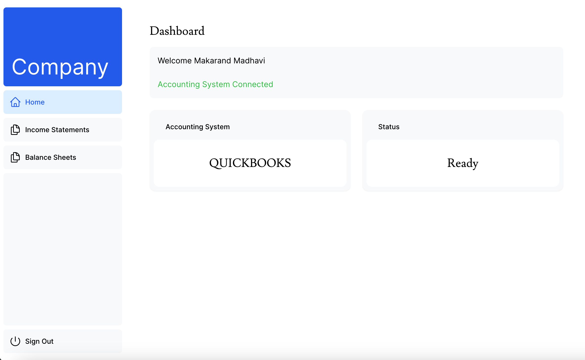
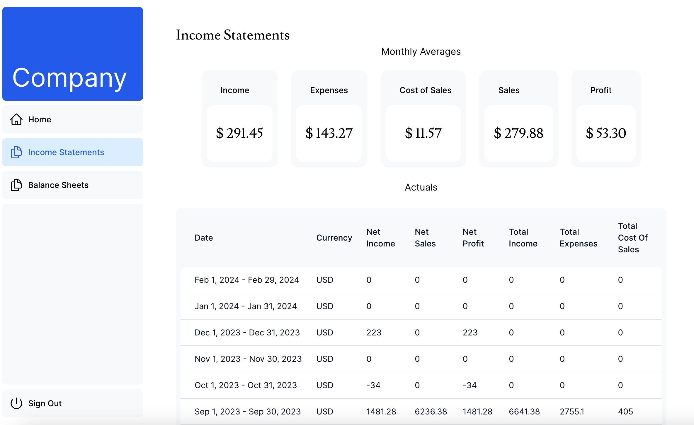
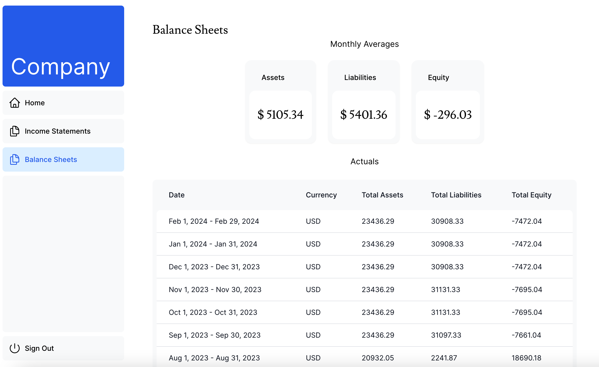

# Next.js App with PostgreSQL Database and API Integration

This repository contains a Next.js application integrated with a PostgreSQL database. A Learning project that modifies [Next.js App Router Course - Starter](https://nextjs.org/learn).

## Live Demo

[https://api-integration.makarandmadhavi.me/](https://api-integration.makarandmadhavi.me/)

- username: ```accountingtest@test.com```
- password: ```123456```

## Tech Stack

- Next.js
- Postgres
- Prisma
- TypeScript
- Tailwind css

## Screens

- Dashboard
  
- Income Statement
  
- Balance Sheets
  

